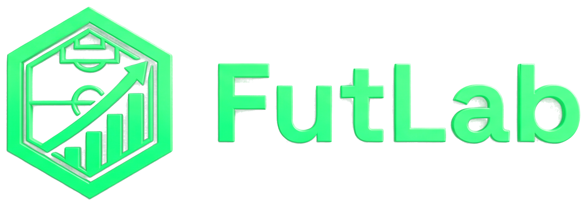

# ⚽ FutLab — Rendimiento Élite

**FutLab** es una plataforma de vanguardia diseñada para la gestión, seguimiento y optimización del rendimiento en academias de fútbol profesionales y amateurs. 



## 🚀 Características Principales

- **Panel de Control de Élite**: Visualización de métricas de rendimiento mediante gráficos de radar.
- **Motor de Atributos Realistas**: Algoritmos de cálculo de OVR (Overall) basados en posición táctica y segmentación del jugador.
- **Gestión Multi-Academia**: Tablero Kanban para directores técnicos y gestores de plantillas regionales.
- **Integración de Wearables**: Monitoreo de BIometría (IMC, Pulso) y dispositivos (Apple Watch, Oura Ring).
- **Onboarding Inteligente**: Flujo de registro personalizado con calibración de identidad visual.

## 🛠️ Stack Tecnológico

- **Core**: HTML5, CSS3 (Modern Vanilla Architecture), JavaScript (ES6+).
- **Gráficos**: Chart.js 4.4.1.
- **Iconografía**: Lucide Icons.
- **Persistencia**: LocalStorage con manejo de versiones de esquema.
- **Tipografía**: Satoshi (Fontshare).

## 📦 Estructura del Proyecto

```text
├── assets/             # Imágenes y recursos estáticos
├── src/                # Código fuente modular
│   ├── js/             # Módulos de lógica (Auth, Academy, Player)
│   └── styles/         # Estilos específicos por módulo
├── index.html          # Punto de entrada (Landing Page)
├── dashboard.html      # Estructura del Dashboard principal
├── app.js              # Lógica central del sistema
└── styles.css          # Estilos globales y tokens de diseño
```

## 🌐 Despliegue

Este proyecto está diseñado para ser desplegado como un sitio estático en plataformas como **Vercel**, **GitHub Pages** o **Netlify**.

---
© 2026 FutLab Performance Unit. Todos los derechos reservados.
